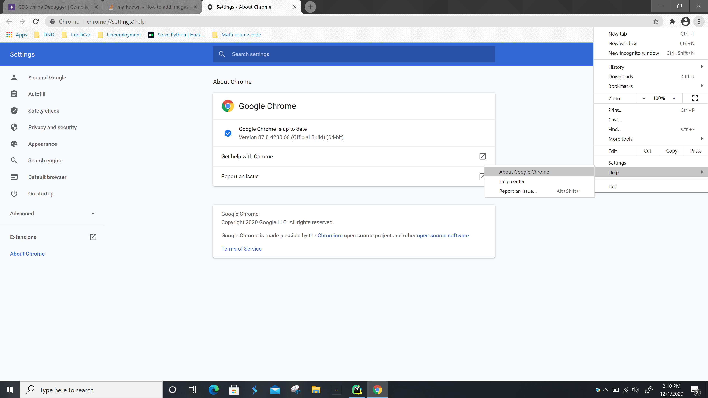
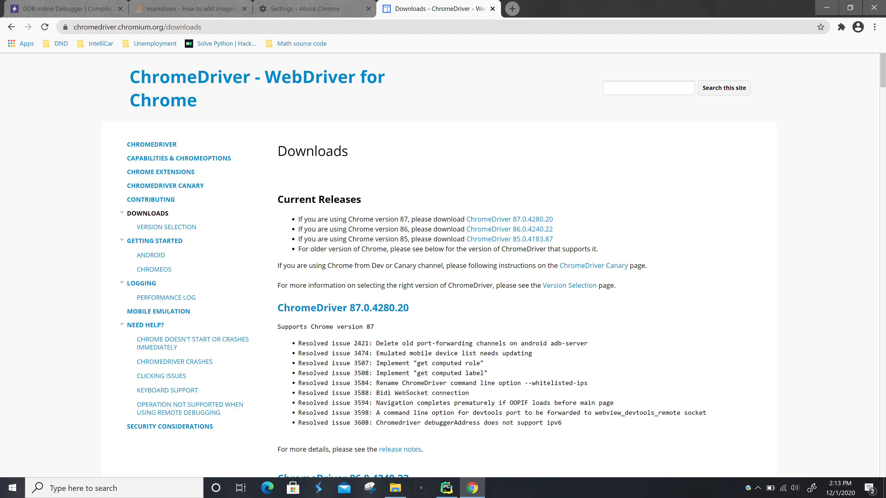
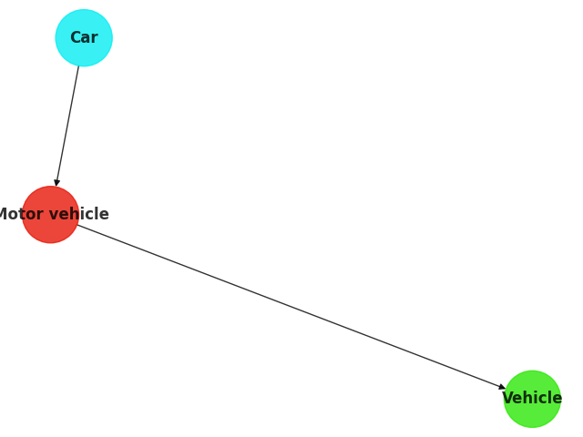

#Depth First Search Wikipedia Webcrawler
___
##Needed To Run
___
- Open up a session of Chrome and click on the 3 dots in the upper right corner
- Help -> About Google Chrome -> Version
- 
- Go to [driver_download](https://chromedriver.chromium.org/downloads)
- Search for the correct version and select your operating system 
- Cut the chromedriver.exe from the downloaded zip file and paste in your desired drive
___

##How to run
___
python pip install requirements.txt
python wiki_crawler.py [-h, --help] [computer drive] [starting word] [search word]
___
- -h or --help: brings up a help message
- starting word will be searched in the search bar of wikipedia.org and will be the starting node
- search word if found at a depth of 6 or lower will be plotted from origin to search word in a graph
- It is best to use words that are closely related as a wait is used for the page traversal to allow HTML elements on the page to load
- I used Car for the start word and Vehicle for the search word which traversed around 220 links and it takes around 5-10 minutes to run
- If the word is not found within 1000 links, the visited links will have to be adjusted accordingly in wiki_crawler.py in DFS method of the crawler class
- Currently the program is running on a headless driver, to watch the program traverse remove the options portion in the init method in the crawler class
___
##Example Ouput
___
- Single_Source_Shortest_path in networkx utilized to retrieve relevant traversal nodes
-  
___
##links
___
- contact me at my [UMSL email](ch3rc@mail.umsl.edu) if you have any questions